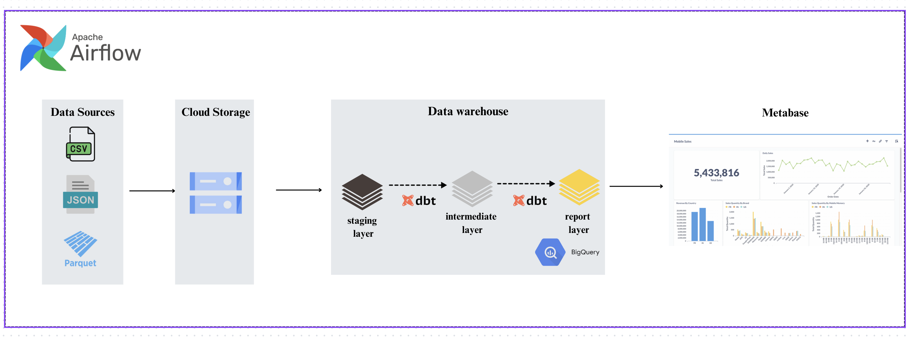
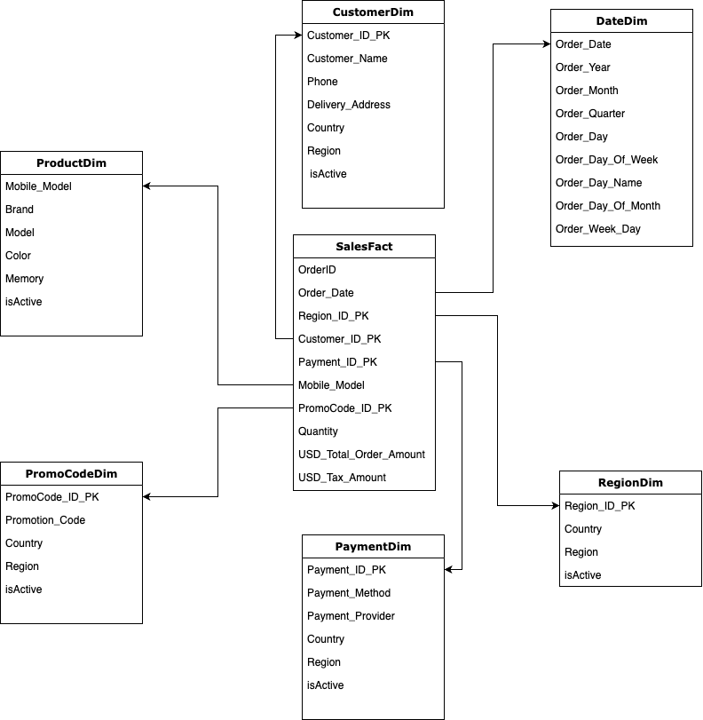
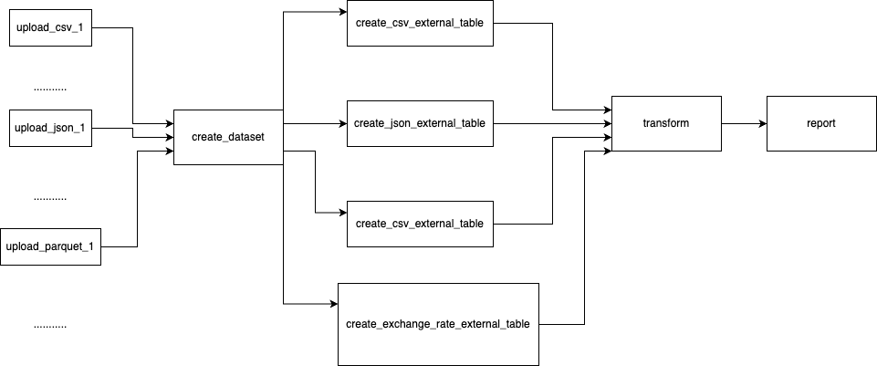
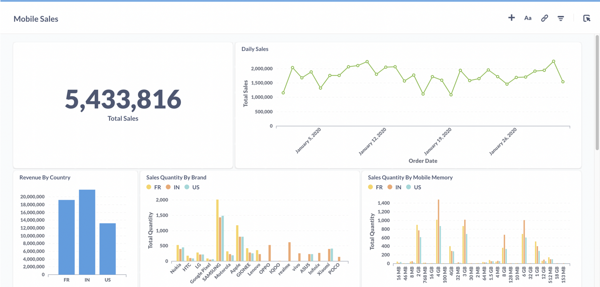

# Mobile Sales ETL Pipeline: Data Warehousing with dbt, Airflow, and BigQuery

I am undertaking this project to gain hands-on experience in building a data warehouse and to deepen my understanding of how dbt, Airflow, and BigQuery work in concert.

## 1. Introduction

This project focuses on building an data pipeline to manage, transform, and analyze sales data from mobile phone retailers on Amazon. The pipeline utilizes Apache Airflow for orchestration, Google Cloud Storage for data management, BigQuery for data warehousing, and dbt for transformation.

## 2. Dataset overview

The dataset used for this project contains order transactions from mobile phone retailers on Amazon in 3 different countries (USA, India, France) in January 2020. Each record in the dataset represents a single order and includes detailed information about the customer's purchase, shipping status, and payment details. Below are the key columns present in the dataset:

- **Order_ID**: A unique identifier for each order.
- **Customer_Name**: The name of the customer who placed the order.
- **Mobile_Model**: A detailed description of the mobile phone model, including brand, model, color, RAM, and storage capacity.
- **Quantity**: The number of units of the mobile phone ordered.
- **Price_per_Unit**: The price of a single unit of the mobile phone in USD.
- **Total_Price**: The total price of the order before tax, calculated as `Quantity * Price_per_Unit`.
- **Promotion_Code**: An optional field indicating any promotion code applied to the order. Null values indicate no promotion was used.
- **Order_Amount**: The total amount of the order, which includes the total price and applicable tax.
- **Tax**: The tax amount applied to the order.
- **Order_Date**: The date when the order was placed.
- **Payment_Status**: Indicates whether the order has been paid or is pending.
- **Shipping_Status**: Shows the shipping status of the order, such as whether the order was delivered, returned, or is still in transit.
- **Payment_Method**: Specifies the method of payment used, such as debit card, credit card, etc.
- **Payment_Provider**: The payment provider used for the transaction, such as Visa, MasterCard, etc.
- **Phone**: Contact phone number of the customer.
- **Delivery_Address**: The address where the order was to be delivered.

## 3. Design

### 3.1 Pipeline architecture and workflow

The architecture of this project includes:

- **Apache Airflow**: Used to orchestrate the data flow from source to storage and processing. I used AstroCLI to set up Airflow.
- **Cloud Storage**: All raw data from the sources is loaded into Cloud Storage for management and storage.
- **Data Warehouse (BigQuery)**:
  - **dbt (Data Build Tool)**: Used to perform transformations on the data.
    - **Staging Layer**: Raw data from Cloud Storage.
    - **Intermediate Layer**: Transform data and create dimensional models.
    - **Report Layer**: Create models for reports to gain insight into data.
- **BigQuery**: Serves as the data warehouse platform for storing and querying transformed data.
- **Metabase**: Used for creating reports and dashboards from the transformed data in BigQuery.

### 3.2 Dimensional Modeling with Mobile Sales

There are three dimension tables:
- **dim_date**: The date dimension table contains detailed information about dates, allowing for comprehensive time-based analysis.
- **dim_airports**: Contains information about airports, providing context for departure and arrival locations.
- **dim_airlines**: Holds details about airlines, enabling analysis of flights based on their operators.

Fact table:
- **fact_flight_activities**: Captures detailed events and metrics for each flight, referencing the dimension tables to enable rich analysis.

### 3.3 DAGs

DAGs orchestrate the flow of data, from loading the raw files into Cloud Storage, through transformations in BigQuery, and finally into dbt models for further processing.

### 3.4 Dashboard

## Key Highlights from the Data

India Dominates the Market: India has the highest revenue among the three countries. Surprisingly, the US has lower revenue than both France and India.

Larger Memory Capacity is Popular: Consumers increasingly prefer mobiles with larger RAM capacities (1-6GB). So, I can see there is a growing demand for phones with larger RAM.

Samsung is the Leading Brand: In 2020, Samsung had the highest revenue among all brands in all three countries. However, it could now be Apple, which has become more popular

